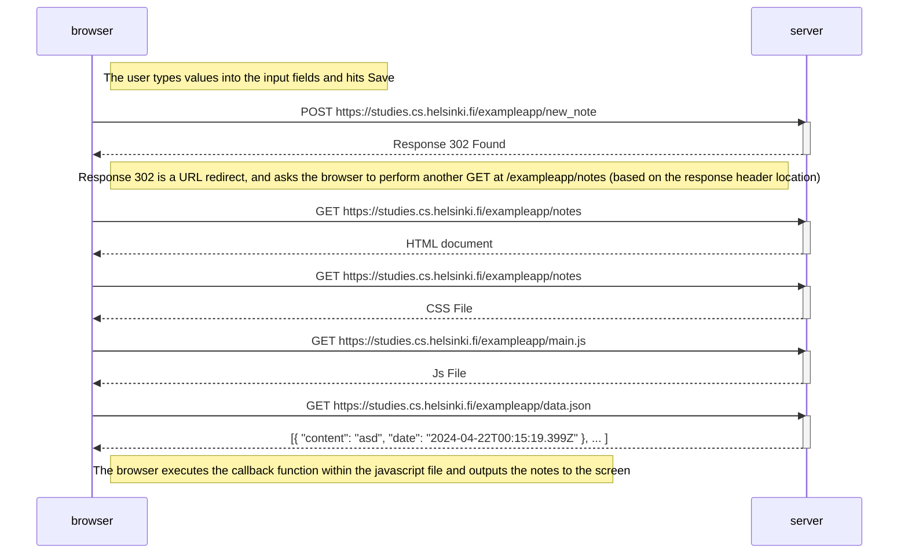

```mermaid
sequenceDiagram
    participant browser
    participant server

    Note right of browser: The user types values into the input fields and hits Save

    browser->>server: POST https://studies.cs.helsinki.fi/exampleapp/new_note
    activate server
    server-->>browser: Response 302 Found
    deactivate server

    Note right of browser: Response 302 is a URL redirect, and asks the browser to perform another GET at /exampleapp/notes (based on the response header location)

    browser->>server: GET https://studies.cs.helsinki.fi/exampleapp/notes
    activate server
    server-->>browser: HTML document
    deactivate server

    browser->>server: GET https://studies.cs.helsinki.fi/exampleapp/notes
    activate server
    server-->>browser: CSS File
    deactivate server

    browser->>server: GET https://studies.cs.helsinki.fi/exampleapp/main.js
    activate server
    server-->>browser: Js File
    deactivate server

    browser->>server: GET https://studies.cs.helsinki.fi/exampleapp/data.json
    activate server
    server-->>browser: [{ "content": "asd", "date": "2024-04-22T00:15:19.399Z" }, ... ]
    deactivate server

    Note right of browser: The browser executes the callback function within the javascript file and outputs the notes to the screen
```