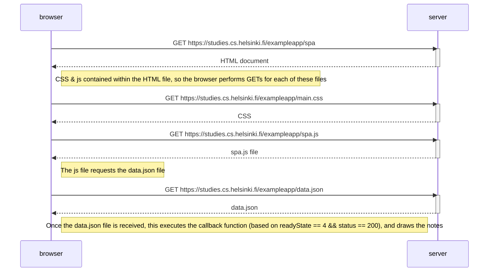

```mermaid
sequenceDiagram
    participant browser
    participant server

    browser->>server: GET  https://studies.cs.helsinki.fi/exampleapp/spa
    activate server
    server-->>browser: HTML document
    deactivate server

    Note right of browser: CSS & js contained within the HTML file, so the browser performs GETs for each of these files

    browser->>server: GET https://studies.cs.helsinki.fi/exampleapp/main.css
    activate server
    server-->>browser: CSS
    deactivate server

    browser->>server: GET https://studies.cs.helsinki.fi/exampleapp/spa.js
    activate server
    server-->>browser: spa.js file
    deactivate server

    Note right of browser: The js file requests the data.json file

    browser->>server: GET https://studies.cs.helsinki.fi/exampleapp/data.json
    activate server
    server-->>browser: data.json
    deactivate server

    Note right of browser: Once the data.json file is received, this executes the callback function (based on readyState == 4 && status == 200), and draws the notes


```