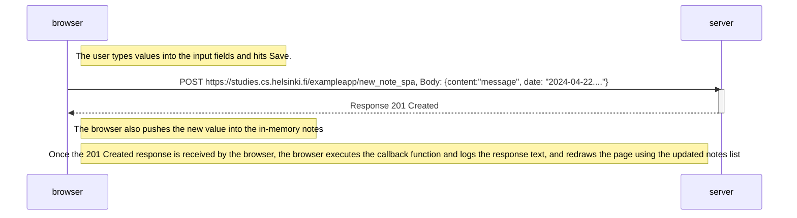

```mermaid
sequenceDiagram
    participant browser
    participant server

    Note right of browser: The user types values into the input fields and hits Save. 

    browser->>server: POST https://studies.cs.helsinki.fi/exampleapp/new_note_spa, Body: {content:"message", date: "2024-04-22...."}
    activate server
    server-->>browser: Response 201 Created
    deactivate server

    Note right of browser: The browser also pushes the new value into the in-memory notes

    Note right of browser: Once the 201 Created response is received by the browser, the browser executes the callback function and logs the response text, and redraws the page using the updated notes list


```